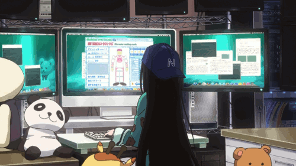

<div align="center">



<br/>

✦　⋆　𖤐　⋆　✦　🦋　✦　⋆　𖤐　⋆　✦

<h1>𝑺 𝑼 𝑽 𝑨 𝑵 𝑰</h1>
<h1>𝑾 𝑨 𝑮 𝑯 𝑴 𝑨 𝑹 𝑬</h1>

<h3>Data Science • Machine Learning • Code • Stories</h3>


<br/>

✧　⋆　☾　⋆　✧　🦋　✧　⋆　☽　⋆　✧

<br/><br/>

<a href="https://www.linkedin.com/in/suvani-waghmare-4a0949379">

</a>

<a href="https://github.com/suvaniwaghmare085-droid">

</a>

<a href="https://leetcode.com/u/Suvani_12/">

</a>

<a href="https://www.hackerrank.com/profile/suvaniwaghmare01">

</a>

<a href="https://www.codechef.com/users/suvani_12">

</a>

<a href="https://www.geeksforgeeks.org/profile/suvani12">

</a>

<a href="https://hashnode.com/@suvani12">

</a>

<a href="https://medium.com/@suvaniwaghmare02">

</a>

<a href="https://www.hackerearth.com/suvaniwaghmare02">

</a>

<a href="https://x.com/SuvaniW61316">

</a>

<br/><br/>


</div>

<br/>

---

<div align="center">

<h2>✦ 𝑴𝒚 𝑳𝒊𝒕𝒕𝒍𝒆 𝑼𝒏𝒊𝒗𝒆𝒓𝒔𝒆 ✦</h2>

<h4><i>where data meets imagination, and every idea gets a chance to become real.</i></h4>

</div>

<table align="center" width="100%">
<tr>

<td width="55%" valign="top">

<h3>🦋 𝑨 𝑳𝒊𝒕𝒕𝒍𝒆 𝑨𝒃𝒐𝒖𝒕 𝑴𝒆</h3>

<p>
I'm <b>Suvani</b>, a B.Tech CSE student specializing in
<b>Data Science & Machine Learning</b>, fascinated by the space where technology and creativity overlap.
</p>

<p>
I'm learning to turn data into insights, ideas into applications, and curiosity into things I can actually build.
My current world revolves around <b>Python, Data Science, Machine Learning, DSA and problem solving</b>.
</p>

<p>
And then there is my other universe — <b>writing</b>.
I'm also a freelance story writer, and somehow I can write <b>20+ stories in a month</b>.
</p>

<h4>
✦ <i>Some days I write Python.</i><br/>
✦ <i>Some days I write people.</i><br/>
✦ <i>Some days I build entire worlds.</i>
</h4>

</td>

<td width="45%" valign="top">

<h3>☾ 𝑪𝒖𝒓𝒓𝒆𝒏𝒕𝒍𝒚</h3>

```text
╭──────────────────────────────────╮
│                                  │
│  ~/suvani                        │
│                                  │
│  $ whoami                        │
│  suvani                          │
│                                  │
│  $ role                          │
│  aspiring_data_scientist         │
│                                  │
│  $ learning                      │
│  python • dsa • ml • data        │
│  science                         │
│                                  │
│  $ creating                      │
│  projects • stories • ideas      │
│                                  │
│  $ status                        │
│  learning & building ✦           │
│                                  │
╰──────────────────────────────────╯
```

</td>

</tr>
</table>

<br/>

<div align="center">

<h2>✦ <i>curiosity &gt; perfection</i> ✦</h2>

</div>

---

<!-- ═══════════════════════════════════════════════════════ -->

<!--                 ✦ SKILLS & EXPERTISE ✦                 -->

<!-- ═══════════════════════════════════════════════════════ -->

<div align="center">

<h2>✦ 𝑺𝒌𝒊𝒍𝒍𝒔 & 𝑻𝒉𝒊𝒏𝒈𝒔 𝑰 𝑪𝒓𝒆𝒂𝒕𝒆 𝑾𝒊𝒕𝒉 ✦</h2>

<i>not just a list of technologies — the things I'm learning to create with.</i>

</div>

<br/>

<!-- ═════════════════════ ROW 1 ═════════════════════ -->

<table align="center" width="100%">
<tr>

<td width="50%" valign="top">

<div align="center">

<h3>🐍 𝑳𝒂𝒏𝒈𝒖𝒂𝒈𝒆𝒔 & 𝑷𝒓𝒐𝒈𝒓𝒂𝒎𝒎𝒊𝒏𝒈</h3>

<br/>


<br/><br/>

<b>Python</b>　✦　<b>JavaScript</b>　✦　<b>Java</b>　✦　<b>C</b>

<br/><br/>

<sub>Object-Oriented Programming　•　Problem Solving</sub>

</div>

</td>

<td width="50%" valign="top">

<div align="center">

<h3>🌐 𝑾𝒆𝒃 𝑫𝒆𝒗𝒆𝒍𝒐𝒑𝒎𝒆𝒏𝒕</h3>

<br/>


<br/><br/>

<b>HTML5</b>　✦　<b>CSS3</b>

<br/><br/>

<sub>Web Design　•　Frontend Basics　•　Responsive Design</sub>

</div>

</td>

</tr>
</table>

<br/>

<!-- ═════════════════════ ROW 2 ═════════════════════ -->

<table align="center" width="100%">
<tr>

<td width="50%" valign="top">

<div align="center">

<h3>🧠 𝑫𝒂𝒕𝒂 𝑺𝒄𝒊𝒆𝒏𝒄𝒆 & 𝑴𝑳</h3>

<br/>


  


  


  


  


<br/><br/>

<b>TensorFlow</b>　✦　<b>Pandas</b>　✦　<b>NumPy</b>

<br/>

<b>Scikit-learn</b>　✦　<b>MySQL</b>　✦　<b>Data Analysis</b>

<br/><br/>

<sub>Machine Learning　•　Data Analysis　•　DBMS</sub>

</div>

</td>

<td width="50%" valign="top">

<div align="center">

<h3>🛠️ 𝑻𝒐𝒐𝒍𝒔 & 𝑻𝒆𝒄𝒉𝒏𝒐𝒍𝒐𝒈𝒊𝒆𝒔</h3>

<br/>


<br/><br/>


<br/><br/>

<b>Git</b>　✦　<b>GitHub</b>　✦　<b>VS Code</b>　✦　<b>AutoCAD</b>

<br/><br/>

<sub>Version Control　•　GitHub Projects　•　Development Tools</sub>

</div>

</td>

</tr>
</table>

<br/>

<div align="center">

✦　🦋　✦　🦋　✦

</div>

---

<!-- ═══════════════════════════════════════════════════════ -->

<!--                    ✦ BEYOND THE CODE ✦                 -->

<!-- ═══════════════════════════════════════════════════════ -->

<div align="center">

<h2>✦ 𝑩𝒆𝒚𝒐𝒏𝒅 𝑻𝒉𝒆 𝑪𝒐𝒅𝒆 ✦</h2>

<i>because creativity doesn't stop at programming.</i>

</div>

<br/>

<table align="center" width="100%">

<tr>

<td width="50%" valign="top">

<div align="center">

<h3>✍️ 𝑾𝒓𝒊𝒕𝒊𝒏𝒈 & 𝑪𝒐𝒏𝒕𝒆𝒏𝒕</h3>

✦ <b>Content Writing</b>　✦　<b>Technical Writing</b>

<br/>

✧ <b>Creative Writing</b>　✧　<b>Fiction Writing</b>

<br/>

✦ <b>Non-fiction Writing</b>　✦　<b>Report Writing</b>

<br/>

✧ <b>Web Content</b>　✧　<b>Story Writing</b>

</div>

</td>

<td width="50%" valign="top">

<div align="center">

<h3>📱 𝑺𝒐𝒄𝒊𝒂𝒍 𝑴𝒆𝒅𝒊𝒂 & 𝑴𝒂𝒓𝒌𝒆𝒕𝒊𝒏𝒈</h3>

✦ <b>Social Media Marketing</b>

<br/>

✧ <b>Social Media Management</b>

<br/>

✦ <b>Content Strategy</b>　✦　<b>Brand Storytelling</b>

<br/>

✧ <b>Content Creation</b>　✧　<b>Digital Presence</b>

<br/>

✦ <b>Audience Engagement</b>　✦　<b>Creative Strategy</b>

</div>

</td>

</tr>

<tr>

<td width="50%" valign="top">

<div align="center">

<h3>💼 𝑭𝒓𝒆𝒆𝒍𝒂𝒏𝒄𝒊𝒏𝒈</h3>

✦ <b>Content Writing</b>　✦　<b>Story Writing</b>

<br/>

✧ <b>Technical Writing</b>　✧　<b>Web Content</b>

<br/>

✦ <b>Social Media Content</b>

<br/>

✧ <b>Creative Content</b>　✧　<b>Client Communication</b>

<br/>

✦ <b>Content Strategy</b>　✦　<b>Creative Problem Solving</b>

</div>

</td>

<td width="50%" valign="top">

<div align="center">

<h3>🤝 𝑷𝒓𝒐𝒇𝒆𝒔𝒔𝒊𝒐𝒏𝒂𝒍 & 𝑰𝒏𝒕𝒆𝒓𝒑𝒆𝒓𝒔𝒐𝒏𝒂𝒍</h3>

✦ <b>Leadership</b>　✦　<b>Team Leadership</b>

<br/>

✧ <b>Leadership Development</b>　✧　<b>Management</b>

<br/>

✦ <b>Time Management</b>　✦　<b>Planning</b>

<br/>

✧ <b>Organization Skills</b>　✧　<b>Self Confidence</b>

<br/>

✦ <b>Problem Solving</b>　✦　<b>Communication</b>

</div>

</td>

</tr>

</table>

<br/>

<div align="center">

<i>🦋 learning, creating, experimenting & building something of my own.</i>

</div>

---

<div align="center">

<h2>🚀 𝑻𝒉𝒊𝒏𝒈𝒔 𝑰'𝒎 𝑩𝒖𝒊𝒍𝒅𝒊𝒏𝒈</h2>

<h4><i>turning ideas into something that can actually exist.</i></h4>

</div>

<br/>

<table align="center" width="100%">

<tr>

<td width="100%">

<div align="center">

<h2>🦋 𝑳𝑼𝑴𝑰𝑵𝑨</h2>

<h3><i>AI-Powered Personal Safety & Scam Detection Assistant</i></h3>

<p>
✦ An AI-powered project focused on helping users identify potential scams
and improve personal safety.
</p>

<br/>


<br/><br/>

<a href="https://github.com/suvaniwaghmare085-droid/LUMINA-AI-Powered-Personal-Safety-Scam-Detection-Assistant">


</a>

</div>

</td>

</tr>

</table>

<br/>

<div align="center">

✧　⋆　<i>more ideas are quietly loading...</i>　⋆　✧

</div>

---

<div align="center">

<h2>📊 𝑴𝒚 𝑮𝒊𝒕𝒉𝒖𝒃 𝑼𝒏𝒊𝒗𝒆𝒓𝒔𝒆</h2>

<h4><i>little pieces of progress, collected over time.</i></h4>

<br/>


<br/><br/>


<br/><br/>


</div>

<br/>

<div align="center">

<h2>✦ 𝑺𝒖𝒗𝒂𝒏𝒊'𝒔 𝑪𝒐𝒏𝒕𝒓𝒊𝒃𝒖𝒕𝒊𝒐𝒏 𝑼𝒏𝒊𝒗𝒆𝒓𝒔𝒆 ✦</h2>

<a href="https://suvaniwaghmare085-droid.github.io/suvaniwaghmare085-droid/graph.html">


</a>

</div>

---

<div align="center">

<h2>✦ 𝑷𝒓𝒐𝒃𝒍𝒆𝒎 𝑺𝒐𝒍𝒗𝒊𝒏𝒈 ✦</h2>

<h4><i>one problem at a time.</i></h4>

<br/>

<a href="https://leetcode.com/u/Suvani_12/">


</a>

<br/><br/>

<a href="https://leetcode.com/u/Suvani_12/">


</a>

</div>

---

<div align="center">

<h2>🪶 𝑩𝒆𝒚𝒐𝒏𝒅 𝒕𝒉𝒆 𝑪𝒐𝒅𝒆</h2>

<table align="center">

<tr>

<td width="100%">

<div align="center">

<h3>Writing is my other kind of problem solving.</h3>

<p>
I'm a <b>freelance story writer</b>, and I can write <b>20+ stories in a month</b> —
because apparently debugging code wasn't enough, so I decided to debug fictional characters too.
</p>

<br/>

<i>
Somewhere between datasets and daydreams,<br/>
I'm learning how to build things — and tell stories.
</i>

<br/><br/>

✦　🦋　✦　🪶　✦　🦋　✦

</div>

</td>

</tr>

</table>

---

<div align="center">

<h2>🎯 𝑻𝒉𝒆 𝑵𝒆𝒙𝒕 𝑪𝒉𝒂𝒑𝒕𝒆</h2>

<table align="center">

<tr>

<td align="center">
🦋<br/>
<b>Become a</b><br/>
<sub>Data Scientist</sub>
</td>

<td align="center">
🧠<br/>
<b>Master</b><br/>
<sub>DSA</sub>
</td>

<td align="center">
🤖<br/>
<b>Build impactful</b><br/>
<sub>AI/ML projects</sub>
</td>

<td align="center">
🚀<br/>
<b>Build real-world</b><br/>
<sub>applications</sub>
</td>

</tr>

<tr>

<td align="center">
💼<br/>
<b>Gain industry</b><br/>
<sub>experience</sub>
</td>

<td align="center">
🌱<br/>
<b>Keep</b><br/>
<sub>learning</sub>
</td>

<td align="center">
✍️<br/>
<b>Continue</b><br/>
<sub>writing</sub>
</td>

<td align="center">
✦<br/>
<b>Turn ideas</b><br/>
<sub>into reality</sub>
</td>

</tr>

</table>

</div>

---

<div align="center">

<h3>☾ 𝑳𝒊𝒕𝒕𝒍𝒆 𝑬𝒂𝒔𝒕𝒆𝒓 𝑬𝒈𝒈𝒔</h3>

<br/>

✦　<i>Currently loading my next chapter...</i>　✦

<br/><br/>

<code>404: sleep not found</code>

<br/><br/>

✧　<i>Powered by curiosity, caffeine & questionable debugging decisions.</i>　✧

</div>

---

<div align="center">


<br/><br/>

✦　⋆　𖤐　⋆　🦋　⋆　𖤐　⋆　✦

<h2><i>“Code. Learn. Build. Write. Repeat.”</i></h2>

🦋

<br/><br/>

<sub>crafted somewhere between midnight thoughts & morning commits ✦</sub>

<br/><br/>

✧　⋆　☾　⋆　✦　⋆　☽　⋆　✧

</div>
